# WebGL Profiling Lab

[CIS 565](https://cis565-fall-2015.github.io/): GPU Programming and Architecture
University of Pennsylvania

In this lab, we will use the following profiling and debugging tools to analyze the performance of open-source WebGL apps/engines:

* [Chrome DevTools CPU Profiler](https://developers.google.com/web/tools/chrome-devtools/profile/rendering-tools/js-execution) - JavaScript CPU performance
* [Firefox Canvas Debugger]( https://hacks.mozilla.org/2014/03/introducing-the-canvas-debugger-in-firefox-developer-tools/) or [WebGL Inspector](http://benvanik.github.io/WebGL-Inspector/) - see WebGL calls and resources
* [Firefox Shader Editor](https://hacks.mozilla.org/2013/11/live-editing-webgl-shaders-with-firefox-developer-tools/) or [Chrome Shader Editor Extension](https://github.com/spite/ShaderEditorExtension) - edit shaders
* [Web Tracing Framework](http://google.github.io/tracing-framework/) - timeline of WebGL calls per frame
* [Chrome Task Manager](http://www.googlechrometutorial.com/google-chrome-other-settings/Google-chrome-task-manager.html) - memory usage
* Engine specific tools like the Cesium Inspector or BabylonJS Debug layer.
Each team will analyze any two of the WebGL apps below.

Consider the following potential bottlenecks:

* Garbage collector (browser CPU overhead)
* Shader compile and link (driver CPU overhead): `compileShader`, `linkProgram`, `getProgramParameter`, and friends.  See [Asynchronous Shader Compilation](http://toji.github.io/shader-perf/) by Brandon Jones.  When is the performance hit?  See [Lessons learned from Bullying Shader Compilers](http://www.drawelements.com/uploads/news/Syysgraph-2012-public.pdf) by drawElements.
* Texture/buffer upload (driver CPU overhead): `texImage2D`, `texSubImage2D`, `bufferData`, `bufferSubData`, and friends
* `readPixels` (stall CPU and starve GPU)
* `getParameter` and other `get*` functions (stall CPU for inter-process communication)
* How good is the app's view frustum culling, i.e., do a lot of calls to `drawElements`/`drawArrays` draw objects that are not visible?  How good is the app's batching, i.e., are there a lot of draw calls for objects with the same material?

Each team will then give a short presentation on their analysis:

For each app you analyzed:
   * Quick demo of the app.
   * Discussion of major bottleneck(s) and how they could be optimized.  Micro-optimizations may be appropriate, but also think higher level such as culling, state sorting, LOD, moving computation to the GPU or a web worker, etc.
      * Include screenshots or demos of profiler output, timeline graphs, shaders, etc.
   * Did the performance or bottlenecks change
      * If the window was resized?
      * If the shaders were simplified in the Shader Editor?  What if just the texture reads are removed?
      * When the camera was moving, e.g., if the app streams WebGL resources, slow-to-render objects become visible, culling becomes less effective, etc?
      * Between frames, e.g., because some frames include shader compile/link, buffer uploads, etc?
      * Between different browsers, e.g., because the app is CPU-bound and the JavaScript engine performance is different?
      * Optional: With ANGLE enabled/disabled (Windows only).  See [How to Enable Native OpenGL in your Browser](http://www.geeks3d.com/20130611/webgl-how-to-enable-native-opengl-in-your-browser-windows/) by JeGX.
      * Optional: When software rendering is used? (see below).

## WebGL Apps and Engines

### [Cesium](http://cesiumjs.org/Cesium/Apps/Sandcastle/index.html?src=3D)

[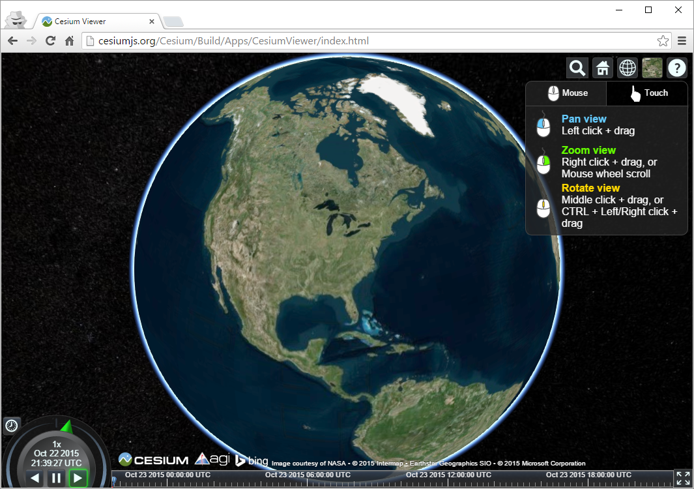](http://cesiumjs.org/Cesium/Apps/Sandcastle/index.html?src=3D)

### [Three.js](http://threejs.org/examples/)

[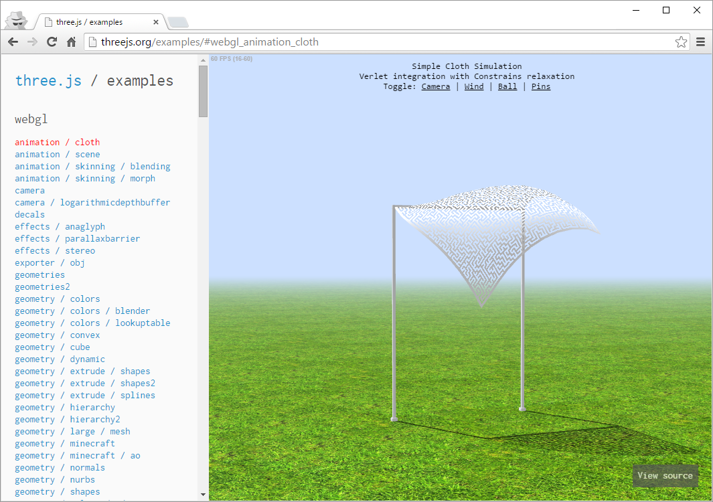](http://threejs.org/examples/)

### [BabylonJS](http://www.babylonjs-playground.com/)

[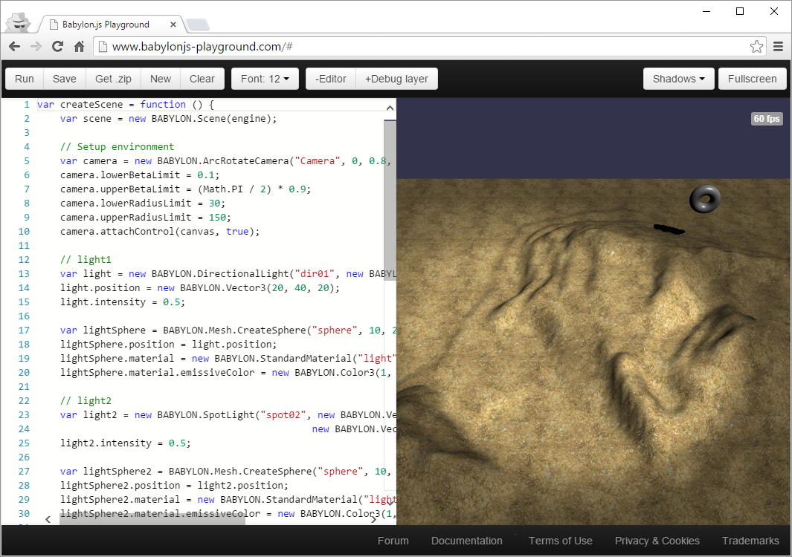](http://www.babylonjs-playground.com/)

### [SceneJS](http://scenejs.org/examples/)

[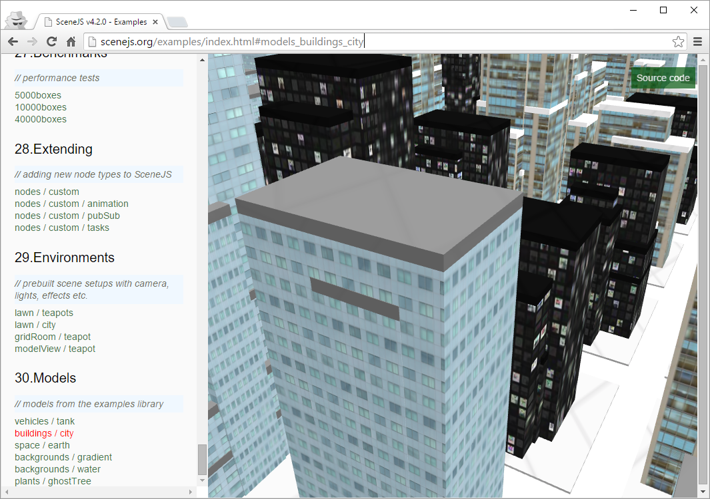](http://scenejs.org/examples/)

### [PEX](http://vorg.github.io/pex/)

[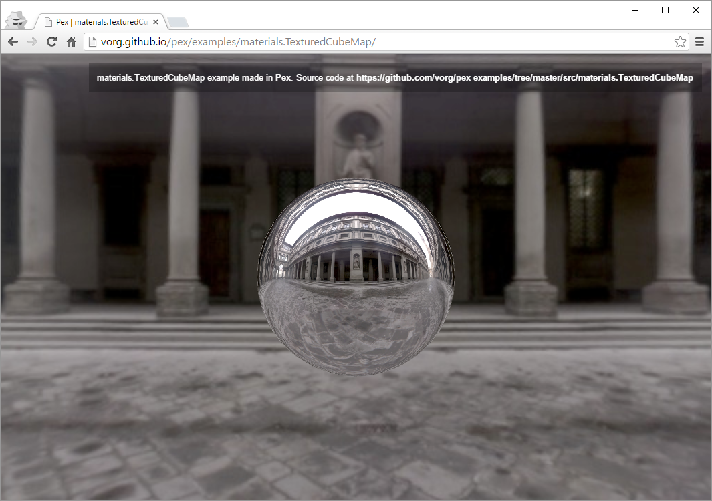](http://vorg.github.io/pex/)

### [SpiderGL](http://spidergl.org/code.php)

[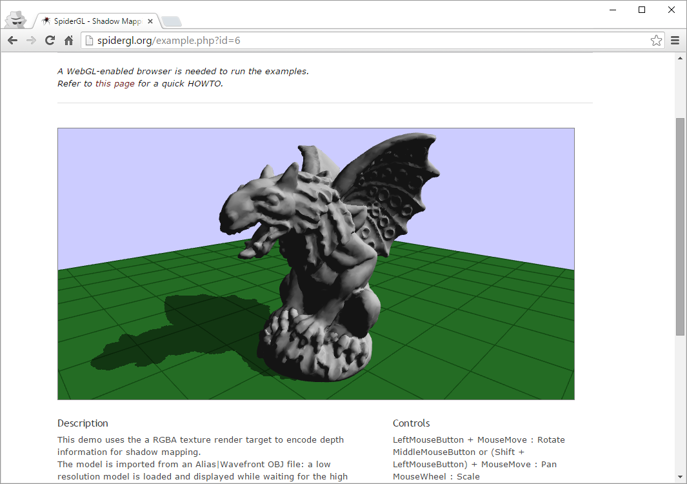](http://spidergl.org/code.php)

### [Udacity Interactive 3D Graphics Demos](https://www.udacity.com/wiki/cs291/demos)

[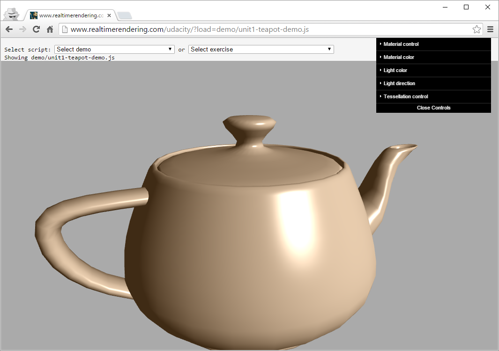](https://www.udacity.com/wiki/cs291/demos)

### [BrainBrowser](https://brainbrowser.cbrain.mcgill.ca/#demos)

[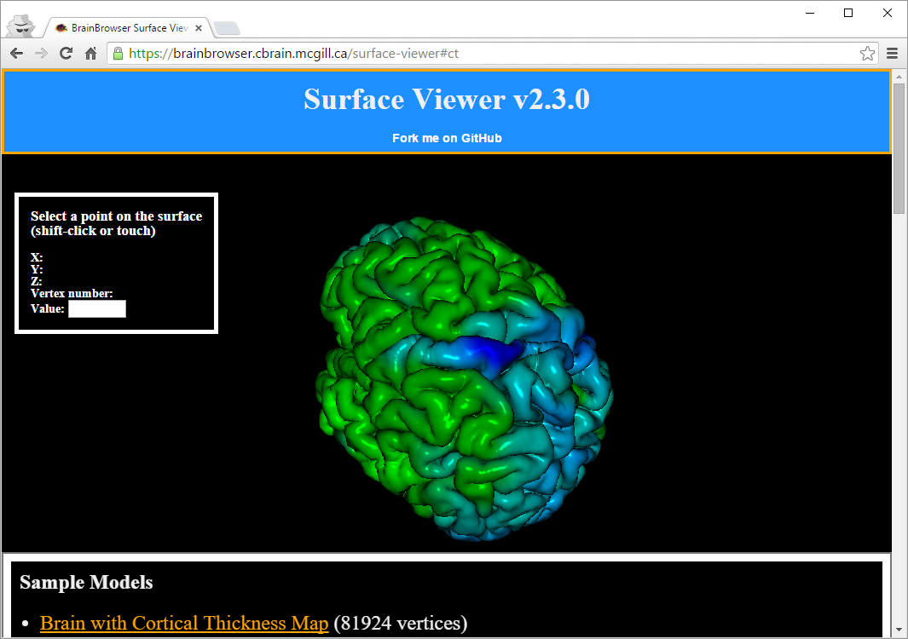](https://brainbrowser.cbrain.mcgill.ca/#demos)

### [Tangram](http://tangrams.github.io/tangram/)

[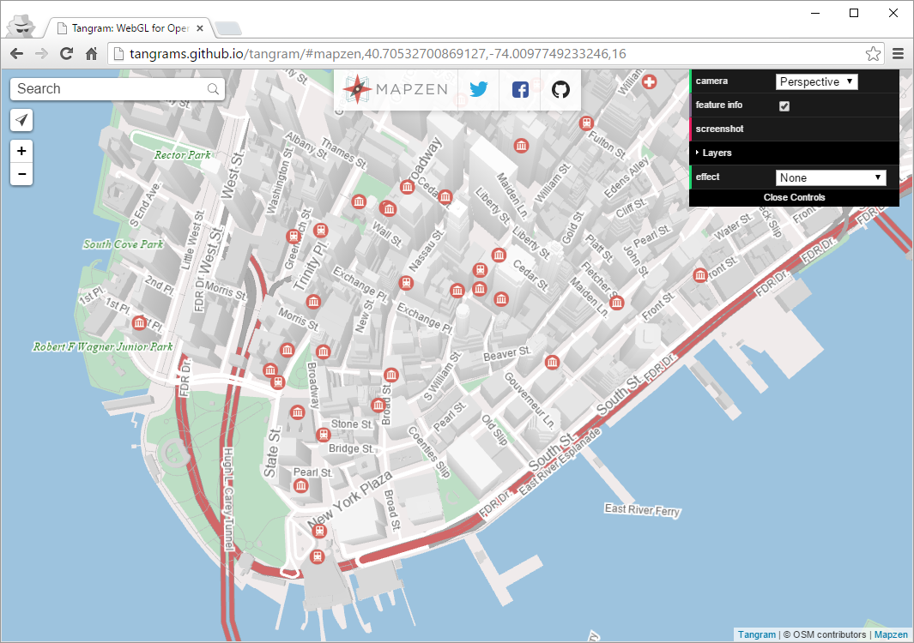](http://tangrams.github.io/tangram/)

### [MapBox GL JS](https://github.com/mapbox/mapbox-gl-js)

[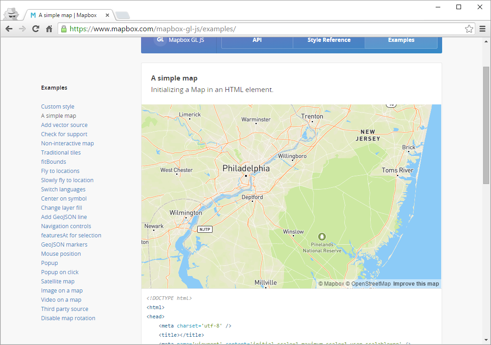](https://github.com/mapbox/mapbox-gl-js)

### [xeoEngine](http://xeoengine.org/examples/)

[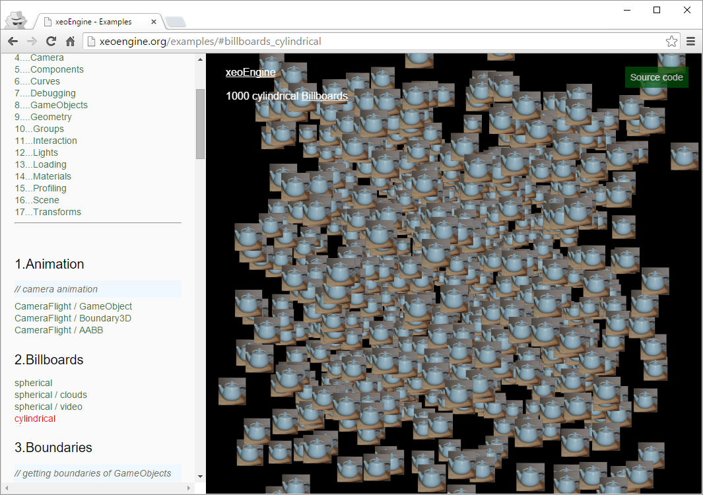](http://xeoengine.org/examples/)

### [PhiloGL](http://www.senchalabs.org/philogl/demos.html)

[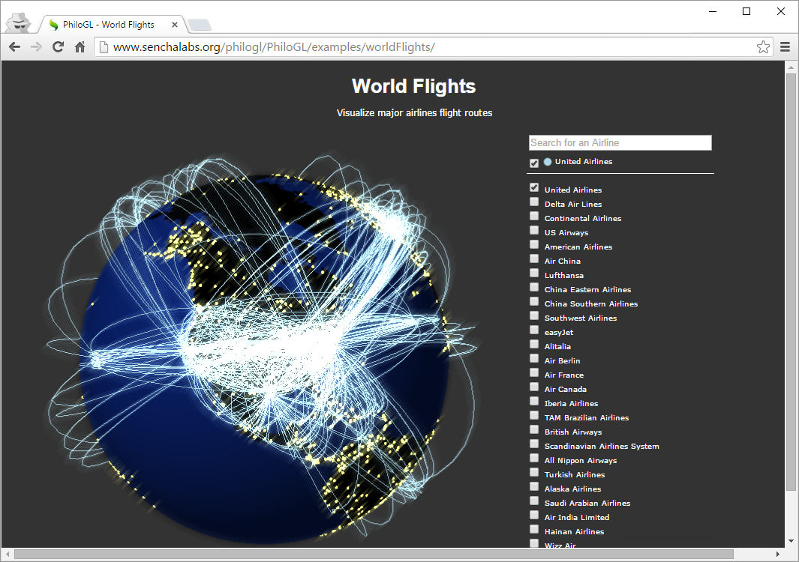](http://www.senchalabs.org/philogl/demos.html)

---

**Software Rendering**

To profile with software rendering, enable [swiftshader](http://transgaming.com/swiftshader) in Chrome.  Close all Chrome tabs and make sure there are no Chrome processes left running.  Then restart Chrome from the command line with `--blacklist-accelerated-compositing --blacklist-webgl` arguments.  Browse to `about:gpu` to see if it worked.  It will take a few minutes for Chrome to download swiftshader.  During this time, no WebGL support will be reported.

## Reading

* [WebGL Debugging and Profiling Tools](http://www.realtimerendering.com/blog/webgl-debugging-and-profiling-tools/) by Patrick Cozzi
* [Graphics Pipeline Performance](http://http.developer.nvidia.com/GPUGems/gpugems_ch28.html) by Cem Cebenoyan